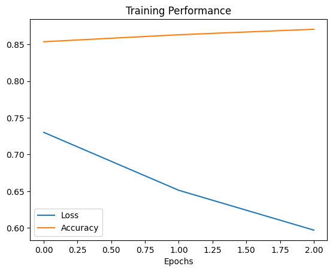
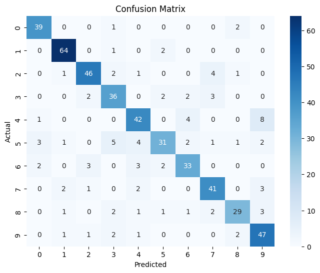
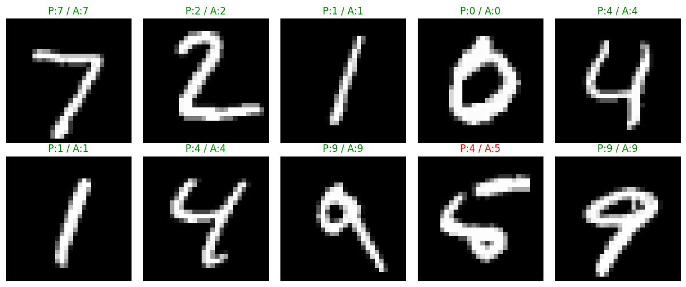

# CNN-from-scratch-MNIST
Custom CNN using NumPy for image classification

# CNN from Scratch (NumPy)

This project is a simple implementation of a Convolutional Neural Network (CNN) built completely from scratch using NumPy. The goal was to understand how CNNs actually work internally without using libraries like TensorFlow or PyTorch.

The model is trained on the MNIST dataset to classify handwritten digits (0–9).

## Features
- Manual implementation of convolution layer  
- ReLU activation function  
- Max pooling layer  
- Fully connected layer  
- Backpropagation from scratch  

## Results
- Test Accuracy: ~81.6%

### Training Performance

### Confusion Matrix

### Predictions

## Outputs
- Confusion Matrix  
- Training graphs (loss and accuracy)  
- Prediction visualization (Predicted vs Actual)  

## Dataset
MNIST handwritten digits (0–9)

## Author
Raj Thakur
